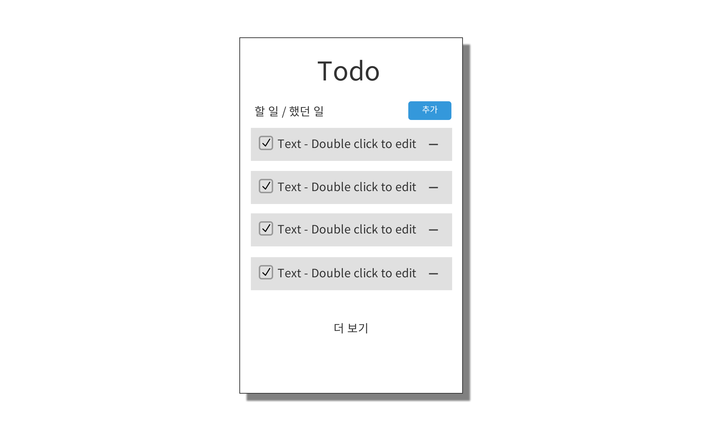

# React와 Firebase를 활용한 Todo Application

## 0. 임시 디자인

## 1. 개요

React와 Firebase를 활용한 Todo 어플리케이션을 만들어 본다. 

React를 구현하여 Redux와 함께 사용하여 상태를 다루는 연습을 하며 styled-components와 같은 외부 라이브러리도 다뤄보는 연습을 한다.

Firebase의 auth와 database 제품을 통해 계정마다의 Todo를 저장할 수 있도록 구현해본다.

## 2. 목표
- React와 Redux의 이해
- Firebase의 auth, database의 이해
- styled-components의 활용
- Git flow 방식 활용

## 3. 기능 명세
### 기본

- [x] page -> TodoList -> Todo 순으로 styled-components를 활용하며 개발한다.

- [x] redux를 활용하여 Todo의 완료 여부 상태를 관리하도록 구현한다.
- [ ] Todo가 완료 될 때, 애니메이션과 효과음을 구현한다.
- [ ] Firebase로 이메일 계정 로그인, 구글 ID 로그인 기능을 구현한다.
- [ ] 계정마다 작성한 Todo를 Firebase의 database에 저장하기

### Extra
- [ ] React-Native로 안드로이드 어플리케이션 구현하기 (Firebase 기능 구현 이전의 커밋 활용)
- [ ] Firebase가 아닌 google 드라이브와 같은 외부 저장소에 파일로 백업할 수 있게 구현하기

## 4. 기술 스택

- React
- React-redux
- React-actions
- Styled-components
- Firebase - auth
- FIrebase - database

## 5. 참고
- material-design-shadows
  - https://gist.github.com/serglo/f9f0be9a66fd6755a0bda85f9c64e85f